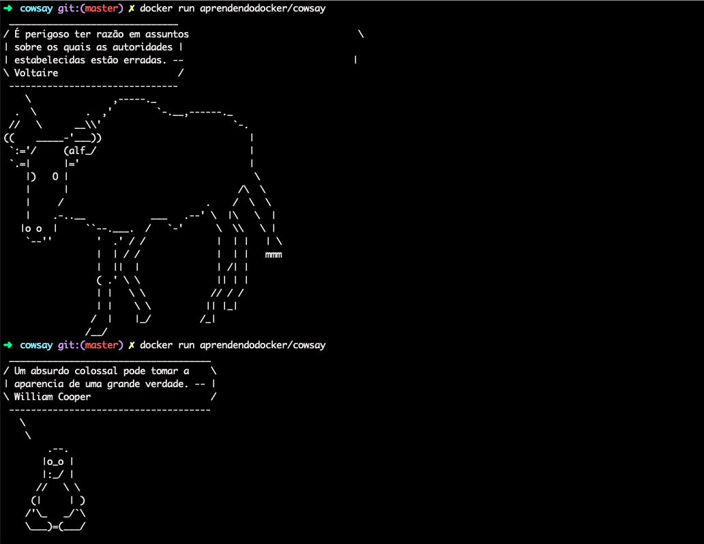

# Cowsay Dockerized

Para construir a imagem entre em um terminal e esteja
dentro do diretório onde se encontra o arquivo `Dockerfile`
e o `entrypoint.sh`.

Defina o `entrypoint.sh` como executável com:

```shell
chmod +x entrypoint.sh
```

Depois utilize o comando:

```bash
docker build -t aprendendodocker/cowsay .
```

Para utilizar a imagem existem dois modos

1. Para mostrar uma mensagem aleatória:

```bash
docker run aprendendodocker/cowsay
```

2. Para mostrar a sua mensagem:

```bash
docker run aprendendodocker/cowsay "Heeeeee"
```

---
